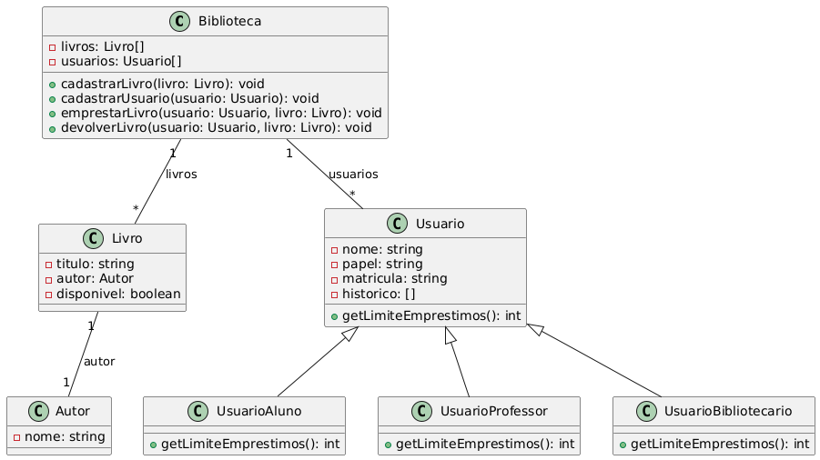

ver: https://stackoverflow.com/questions/14494747/how-to-add-images-to-readme-md-on-github

# 📚 Sistema de Gerenciamento de Biblioteca

## 1. Objetivo do Projeto

Este projeto tem como objetivo simular um sistema de gerenciamento de biblioteca, permitindo o cadastro de usuários (alunos, professores e bibliotecários), autores e livros, além de realizar operações de empréstimo e devolução de livros. O sistema foi desenvolvido para fins didáticos, aplicando conceitos de Programação Orientada a Objetos (POO) em JavaScript.

O projeto contempla:
- Cadastro e validação de usuários, autores e livros.
- Controle de empréstimos e devoluções, respeitando limites por tipo de usuário.
- Relatórios de histórico de empréstimos.
- Testes automatizados para simular operações reais.

## 2. Como Rodar o Projeto

### Pré-requisitos

- Node.js instalado (versão 14+)
- Navegador moderno (para visualizar a interface HTML)

### Passos para execução

1. **Clone ou baixe o repositório.**
2. No terminal, navegue até a pasta do projeto.
3. Execute o comando abaixo para iniciar o projeto (irá rodar no navegador):

```sh
npm install
npm start
```
> **Nota:** O comando `npm start` pode ser substituído por abrir o arquivo [index.html](index.html) diretamente no navegador, pois o projeto é client-side.

4. O resultado das operações será exibido no console do navegador (F12 > Console).

## 3. Estrutura das Classes

O sistema é composto pelas seguintes classes principais:

- [`Biblioteca`](src/Biblioteca.js): Gerencia listas de usuários, autores e livros, além das operações de cadastro, empréstimo e devolução.
- [`Usuario`](src/Usuario.js): Classe base para todos os usuários, com subclasses:
  - [`UsuarioAluno`](src/UsuarioAluno.js): Limite de 3 empréstimos.
  - [`UsuarioProfessor`](src/UsuarioProfessor.js): Limite de 5 empréstimos.
  - [`UsuarioBibliotecario`](src/UsuarioBibliotecario.js): Limite de 1 empréstimo.
- [`Autor`](src/Autor.js): Representa um autor de livro.
- [`Livro`](src/Livro.js): Representa um livro, com informações de título, autor e disponibilidade.

### Diagrama de Classes (UML)



## 4. Funções de Teste

As funções de teste estão localizadas em [tests/cadastro.js](tests/cadastro.js) e [tests/operacao.js](tests/operacao.js).

### Cadastro de Usuários, Autores e Livros

- **Usuários:** São cadastrados alunos, professores e bibliotecários. O sistema impede duplicidade de nomes e valida o tipo de usuário.
- **Autores:** São cadastrados autores com nome, sobrenome e nacionalidade.
- **Livros:** São cadastrados livros vinculados a autores já existentes.

**Exemplo de saída no console:**
```
#1	Cadastrado: Aluno(a) Harry Potter [ Matrícula: A00001 ] --- Limite de empréstimos: 3
#31	! ! ! --> NÃO cadastrado:  Marty McFly
         Usuário já consta da base.
```

### Validações

- Não permite cadastro de usuários com nomes repetidos.
- Não permite cadastro de livros sem autor existente.
- Valida o papel do usuário no momento da criação.

### Empréstimos Aleatórios

A função [`fazerEmprestimos`](tests/operacao.js) realiza 100 tentativas de empréstimos, escolhendo aleatoriamente usuários e livros. Se o usuário ou livro não existir, ou se o livro estiver indisponível, uma mensagem de erro é exibida.

**Exemplo de saída no console:**
```
Empréstimo realizado: Tony Stark [A00006] retirou "O Hobbit" [Código: 10]

! ! ! --> Empréstimo NÃO realizado:
         Livro "O Hobbit" [Código: 10] INDISPONÍVEL para Tony Stark.
```

### Relatórios

O método [`gerarRelatorioUsuario`](src/Biblioteca.js) exibe o histórico de empréstimos e devoluções de cada usuário.

## 5. Imagens de Execução

### Exemplo de Cadastro


### Exemplo de Empréstimos


> Substitua as imagens acima por capturas reais do console, se desejar.

## 6. Informações Complementares

- O projeto segue princípios de encapsulamento, herança e polimorfismo.
- Cada tipo de usuário possui um limite de empréstimos, definido por sobrescrita do método `getLimiteEmprestimos`.
- O sistema pode ser expandido para incluir novas funcionalidades, como reservas e multas.

---

⌨️ com ❤️